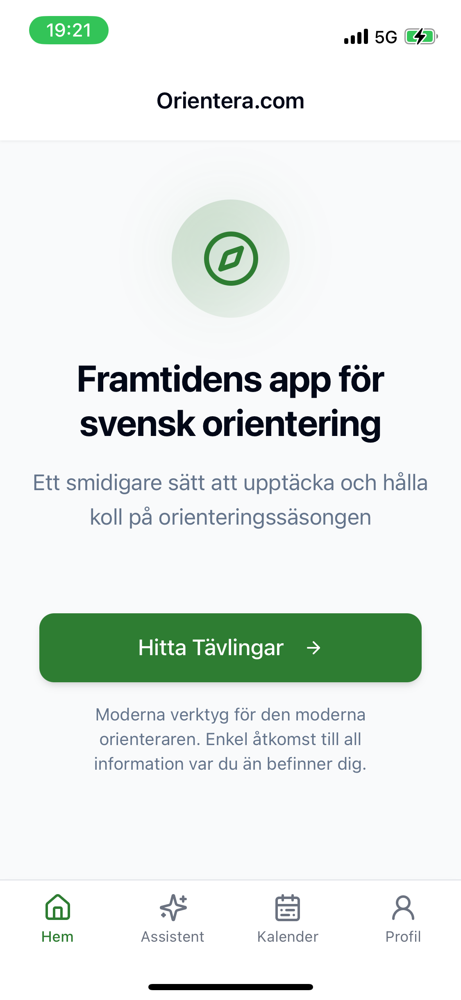
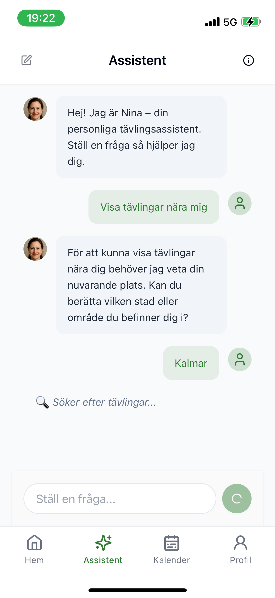
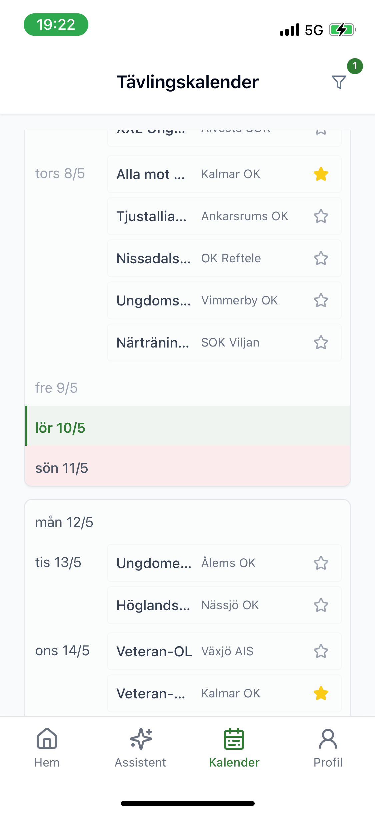
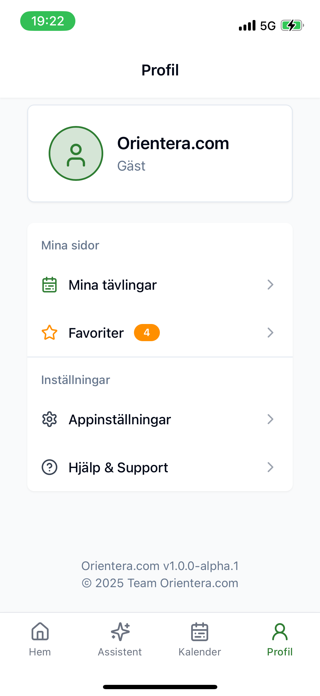

# Orientera.com

**Ett digitalt verktyg - för oss som orienterar**

Orientera.com gör det enklare än någonsin att upptäcka och hålla koll på orienteringstävlingar i Sverige. Med en mobilvänlig design, smart kalender och AI-assistenten *Nina* får du alltid rätt information – var du än är.

---

## 🔍 Vad är Orientera.com?

En modern app för orienterare som vill:

- Hitta tävlingar i närheten
- Få en tydlig överblick i kalenderform
- Spara favoriter och planera säsongen
- Använda en personlig assistent för att få hjälp direkt

---

## 🤖 Din AI-assistent: Nina

I appen finns *Nina* – en AI-baserad tävlingsassistent som förstår dina behov.  
Hon kan:

- Svara på frågor om tävlingar
- Hitta tävlingar baserat på plats och datum
- Hjälpa dig att planera din orienteringssäsong

---

## 📱 Skärmbilder

| Hem | Assistent | Kalender | Profil |
|-----|-----------|----------|--------|
|  |  |  |  |

---

## ⚙️ Modern, mobil och enkel att använda

Orientera.com är byggd från grunden med användaren i fokus:

- Fullt mobilanpassad – känns som en app
- Snabb, responsiv och intuitiv
- AI-driven men mänsklig i känslan

---

> © 2025 Team Orientera.com – För dig som älskar att orientera.
